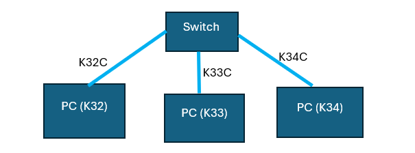
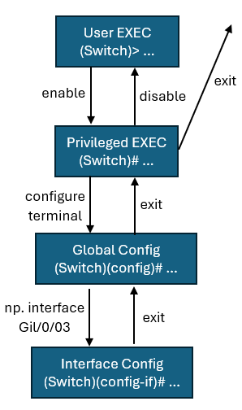
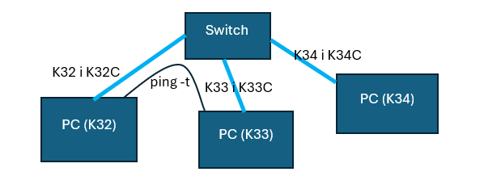

3 komputery podłączone do switch’a przez złącza K32C, K33C, K34C (wejścia konsolowe) kablami normalnymi.

Uruchamiamy **putty** do komunikacji ze switchem (CLI), polecenia:

- `?` – wyświetla listę poleceń
- `show ?` – wyświetla dostępne opcje po komendzie show
- `show interface status` – tabelka z portami switcha (porty z nazwami Gil/0/nr)
- `enable` – profil administratora, więcej poleceń, nie może konfigurować
- `configure terminal` – profil do konfigurowania switcha
    - `show ?` wtedy nie działa
    - `hostname kura` – zmiana nazwy urządzenia
- `exit` – wychodzenie z konfigurowania / wyjście z cli
- `disable` – wychodzenie z administratora

## Schemat trybów użytkownika na switchu:

---

3 komputery dodatkowo podłączone złączami K32, K33, K34 do innego switcha też kablami niebieskimi.

`show interface status` – na jednym komputerze (K34) trzy porty mają statusy connected.  
`ping -t adres` - do nieskończonych pingów  

Nie widać pingów (na wiresharku) na trzecim komputerze (K34), bo switch wysyła do konkretnego adresu. Na hubie już widać pingi.

W trybie „Global configuration” w trzecim komputerze (K34) używamy:

`interface Gil/0/03` – wejście do ustawień interfejsu jednego z komputerów.

`shutdown` – zamykamy połączenie, ping się urywa

`no shutdown` – wznawiamy połączenie, powrót pingów po około 30 sekundach
