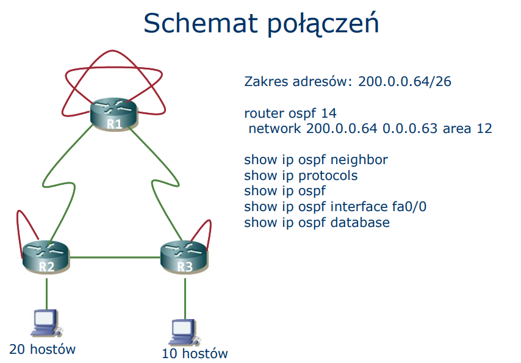
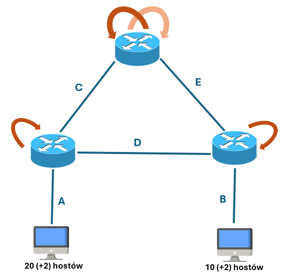
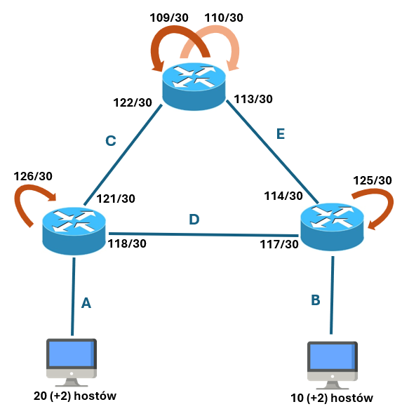

## OSPF

OSPF - „pierwszeństwo ma najkrótsza ścieżka”  
OSPF - protokół stanu łącza ("link-state")

Korzysta z Dijkstry - drzewo minimalne MST

Metryka dla pojedynczego łącza: w CISCO: 10^7 / przepustowość ?

Każdy router ma pełną, identyczną informaację o grafie routerów

LSA - link state advertisement, informacje o boku w grafie

LSU - link state update - przenosi aktualizacje

OSPF działa bezpośrednio w IP (nieszeregowane)

routery porównują wiek komunikatów (gdy zmieni się kolejność), router przekazuje numer sekwencyjny.

Numery mogą się skończyć (chyba się resetują po czasie?)

OSPF co 30 minut informuje innych w sieci, bo LSA wygasa.

pakiety HELLO - nawiązanie sąsiedztwa, sprawdzanie czy łącze jest dwukierunkowe, podtrzymanie relacji, po 3 nieudanych informujemy o nieżywym.

Hierarchia OSPF.

1. nr.0 (backbone)
2. inne

Inne łączą się do nr. 0 poprzez ABR (area border router). Musi mieć taki chociaż 1.

Stub - końcowy fragment, jedno połączenie, nie wysyła części sygnałów ???

Total-stub - nie ma informacji o innych obszarach.

ASBR - router brzegowy (graniczny) obszaru autonomicznego. Router, który przynosi informacje spoza OSPF.  
ASBR nie mają ograniczeń do położenia w OSPF.

DR - designated router - obsługuje sąsiadów, wybierany w sieci rozgłoszeniowej (Ethernet), reprezentant.

DBR - ?

## Zajęcia

Mamy mieć taki schemat połączeń:

Fajna strona pomocna do VLSM: http://www.fatclicks.listy.info.pl/maska_sieci-tabelka.htm

Początkowy adres: 200.0.0.64 /26
Czyli mamy zakres: 200.0.0.64-127 (64 hosty)

Nie za dobrze udało nam się to ogarnąć na zajęciach ale postaram się ogarnąć jakieś drzewo:
- A: 20 (+2) hostów
- B: 10 (+2) hostów

Połączenie pomiędzy routerami to 2 (+2) hosty.  
Na loopbacka potrzebujemy po 1 hoście.

| Liczba hostów | Adresy | Maska |
| :------------ | :----: | ----: |
| 64 | ..., 64-127, ... | 26 |
| 32 | ..., 64-95 (A), 96-127, ... | 27 |
| 16 | ..., 96-111 (B), 112-127, ... | 28 |
| 8 | ..., 112-119, 120-127, ... | 29 |
| 4 | ..., 112-115, 116-119, 120-123, 124-127, ... | 30 |

---
.  
Podział na sektory:

- A: 22 hosty -> 200.0.0.64-95 /27
- B: 12 hostów -> 200.0.0.96-111 /28
- C: 4 hostów -> 200.0.0.112-115 /30
- D: 4 hostów -> 200.0.0.116-119 /30
- E: 4 hostów -> 200.0.0.120-123 /30

Został nam zakres 200.0.0.124-127 więc jakimś cudem mamy to rozdysponować na loopbacki i teraz nie mam pojęcia jak to mamy niby zrobić, ale tak....

Takie mieliśmy po zajęciach:

