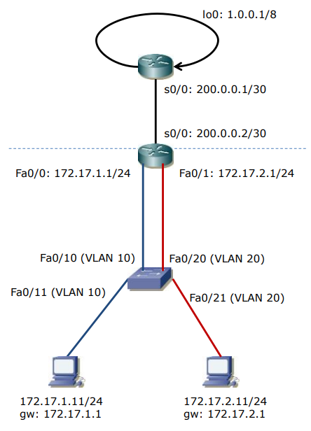

### Co na zajęciach

Tworzymy takie coś:



Konfigurujemy VLANy na switchu:
```
Switch>
enable
    config t
        interface fa0/10
            switchport mode access
            switchport access vlan 10
            exit
        interface fa0/11
            switchport mode access
            switchport access vlan 10
            exit
        interface fa0/20
            switchport mode access
            switchport access vlan 20
            exit
        interface fa0/21
            switchport mode access
            switchport access vlan 20
            exit
```

Konfigurujemy interfejsy na routerze obok switcha:
```
Router>
enable
    config t
        interface fa0/0
            ip address 172.17.1.1 255.255.255.0
            no shutdown
            exit
        interface fa0/1
            ip address 172.17.2.1 255.255.255.0
            no shutdown
            exit
        interface s0/0
            ip address 200.0.0.2 255.255.255.252
            clock rate 64000                       # do łącza szeregowego
            no shutdown
            end
```

Konfigurujemy drugi router (Świat):
```
Swiat>
enable
    config t
        interface s0/0
            ip address 200.0.0.1 255.255.255.252
            clock rate 64000
            no shutdown
        interface loopback 0
            ip address 1.0.0.1 255.0.0.0
```

Konfigurujemy routing statyczny na routerach:
```
Router>
enable
    config t
        ip route 0.0.0.0 0.0.0.0 200.0.0.1   # trasa domyślna na routerze
        end
```

Na świecie:
```
Swiat>
enable
    config t
        ip route 172.17.1.0 255.255.255.0 200.0.0.2
        ip route 172.17.2.0 255.255.255.0 200.0.0.2
```

Konfigurujemy NATa:
```
Router>
enable
    config t
        interface fa0/0
            ip nat inside
            exit
        interface fa0/1
            ip nat inside
            exit
        interface s0/0
            ip nat outside
            exit
        access-list 1 permit any
        ip nat inside source list 1 interface s0/0 overload  # overload to PAT
 end
```

Pomocne do diagnostyki
```
show ip nat translations
show ip nat statistics
```

Na świecie:
```
Swiat#
conf t
    username Q password BA
    ip http server
    line vty 0 4
    login local
    end
```

Wrzucam jeszcze notatki z zajęć żeby nie było, że nie ma:


### Reszta moich notatek z wprowadzenia:

routing między vlanami + pat:

do czego nat
po co

zaleta:
- ukrycie prywatny adresów w sieci


pat korzysta w warstwy transportowej

półasocjacja
protokół, adres, port


jak router poradzi sobie z portami (skoro porty są w warstwie 4)

Bo routery też mogą obsługiwać wyższe warstwy.


Liczba portów 65 536 tcp i 65 536 (udp), icmp nie ma portów (co się uda wydłubać, słaby)

Translacja jeden do jednego (jeden prywatny z publicznym i portem)

Po co nat:
potrzeba: struktura wewnętrzna adresów nie zmienna od zewnętrznego adresu.,
niezmienianie sieci w przypadku zmiany wewnętrznej.,
coś jeszcze?

Ciekawostka - co to sctp: https://pl.wikipedia.org/wiki/Stream_Control_Transmission_Protocol

nie wiemy z którym hostem się komunikujemy

Jakie kolumny ma tabelka:

IL <-> IG  OL <-> OG
nie przenosi się pozycja (inside, outside) zostaje