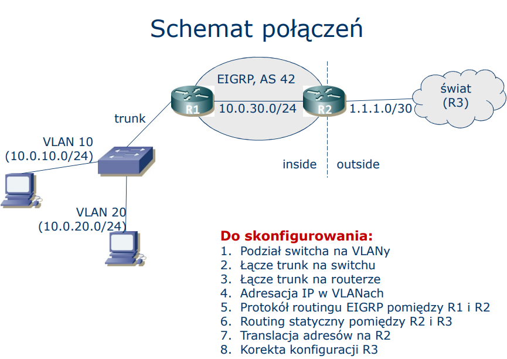
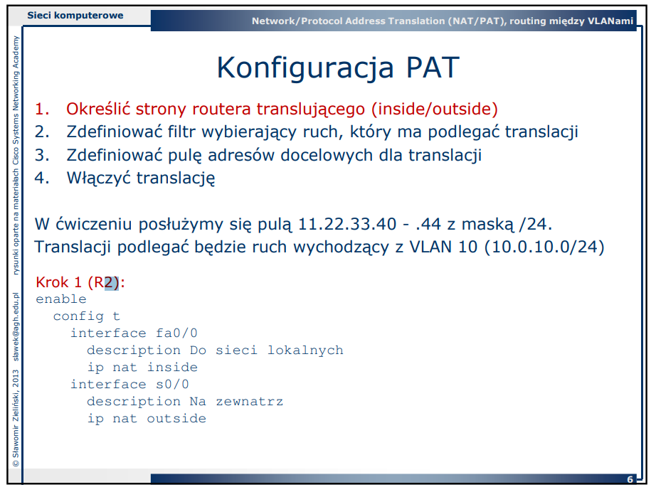
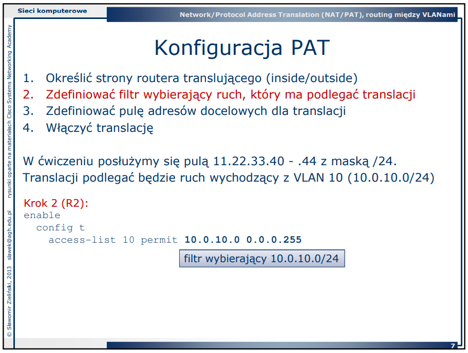
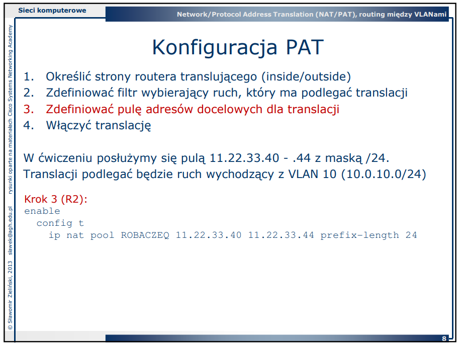
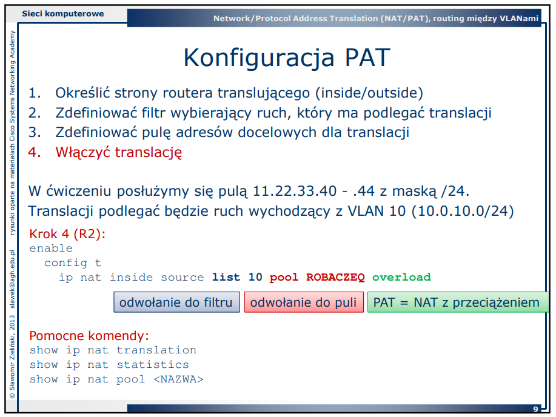
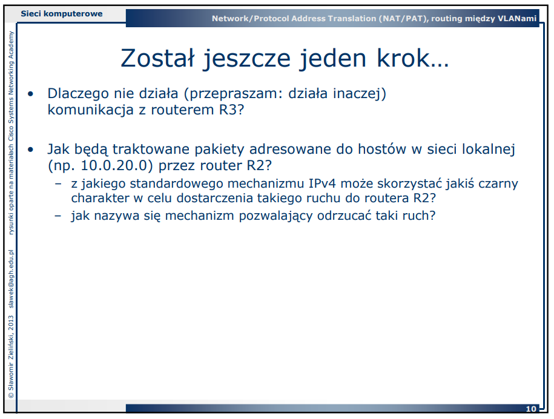
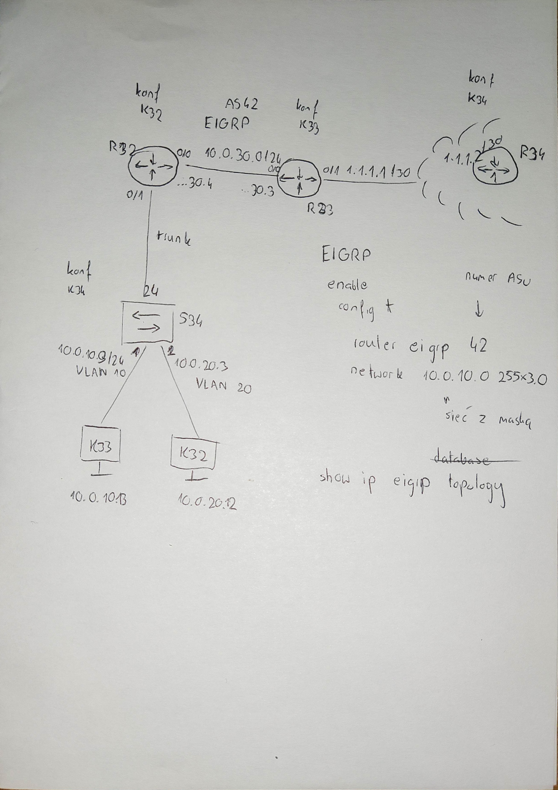

## EIGRP (była zamianka w tematach)

Mamy mieć taki schemat:



### VLAN
```
enable
config t
    vlan 10
    exit

    interface range fa0/1 – 4
        switchport mode access
        switchport access vlan 10
        spanning-tree portfast
        end
```

Zmiana trybu pracy VTP: 
```
enable
config t
    vtp mode transparent
```

Czym jest VTP:
1. Przełącznik zostaje ustawiony w trybie "transparent".
- W tym trybie przełącznik nie propaguje informacji o VLAN-ach do innych przełączników w domenie VTP.
- Przełącznik nie synchronizuje się z serwerem VTP – ignoruje aktualizacje VTP, które otrzymuje z innych urządzeń.
- Można tworzyć, modyfikować i usuwać VLAN-y lokalnie na przełączniku, ale te zmiany nie są przekazywane dalej w domenie VTP.

2. Przełącznik w trybie transparent pełni funkcję "przekaźnika".
- Informacje VTP, które przychodzą na trunki, są jedynie przesyłane dalej do innych przełączników bez wprowadzania zmian w jego lokalnej konfiguracji.

### Komendy pomocnicze na switchu
```
    show interface status
    show vlan
    show int fa0/24 trunk
```

### Ustawiamy trunk

Na switchu:
```
enable
config t
    interface fa0/24
        switchport trunk encapsulation dot1q  <- !tylko na switchach 35**!
        switchport mode trunk     <- !na wszystkich!
```

Na routerze:
```
Konfiguracja łącza trunk na routerze:
enable
config t
    interface fa0/0
        no shutdown
        exit

    v dla każdego VLANU: v

    interface fa0/0.10           <- zamiast 10 może być dowolna liczba (nie ma znaczenia)
        encapsulation dot1q 10   <- numer VLAN
        ip address <A.A.A.A> <M.M.M.M>
        exit
```

### Komendy pomocnicze na routerze
```
    show ip interface brief
    show ip route
```

? Bramą dla hostów jest **logiczny podinterfejs routera**. 
Po skonfigurowaniu wszystkich podinterfejsów powinna zachodzić komunikacja pomiędzy hostami. ?

## EIGRP

Konfiguracja EIGRP:
```
enable
config t
    router eigrp 42                        <- numer ASu
        network 10.0.10.0 255.255.255.0
```

Konfiguracja i redystrybucja trasy statycznej:
```
enable
config t
    ip route A.A.A.A M.M.M.M H.H.H.H
    router eigrp 42
        redistribute static metric <tos> <bw> <dly> <rel> <load> <mtu>   <- metryki trasy
```

### Komendy pomocnicze do EIGRP
```
    show ip route A.A.A.A
    show ip protocols
    show ip eigrp neighbors
    show ip eigrp database
    show ip eigrp topology
```

## Konfiguracja PAT

nie chce mi się już tego kopiować. Macie zdjęcia (jeśli ktokolwiek naprawdę będzie to czytał):

W zasadzie to to samo co w tym pdf w tym samym folderze...









???




### Schemat po zajęciach



😲🙃

### Notatki z wprowadzenia


Co powoduje opóźnienie:
- opóźnienie na przewodzie,
- czas przetwarzania routera,
- serializacja                 <- to się liczy w M

L - najgorszy przypadek (load), procent zajętości bufora
R - niezawodność

**EIGRP jest ważne do egzaminu!**

Metryka to średnia z 5 minut, obliczana co 30 sekund.

Dlaczego K2 domyślnie wyłączone.  
Bo dzielimy w sumie to samo przez siebie. (nie wiemy gdzie się coś wydarzyło)

DUAL - główne zadanie to nie usuwanie cykli,  
bardziej do aktualizacji sieci, ogranicza obszar aktualizacji, wymiana informacji o metrykach.

**Też ważne do egzaminu!**

RIP jest w UDP.  
BGP jest w TCP.  
OSPF tylko w IP.  
EIGRP w **RTP** (RTP do EIGRP), potwierdzenie dostarczenia aktualizacji.
