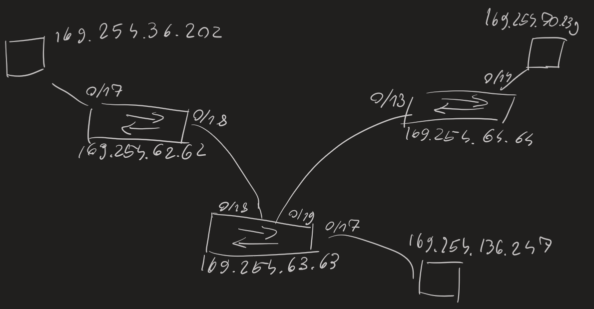

*Piękny obrazek*

Trzy switche spięte ze sobą dwoma białymi kablami, do każdego switcha podpięty komputer niebieskim i komputery się pingują miedzy sobą. Na switchach warto ustawić wcześniej hostname, żeby wiedzieć, który jest który.

Protokół CDP (LLDP) przekazuje informacje diagnostyczne o switchu.

```
enable
	config t
		int vlan 1
			ip address a.a.a.a m.m.m.m
			no shut
			exit
		
		line vty 0 4 - trzeba zawsze ustawić > 1 terminal
			transport input telnet
			login local
			exit
			
		username Q password BA
		enable secret qba
		exit
```

- `show ip interface` - pokazuje ip switcha
- `show cdp neighbor` - informacje o innych switchach podpiętych do tego
- `show cdp neighbor detail`
