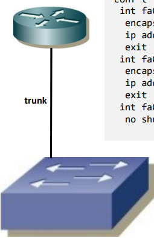
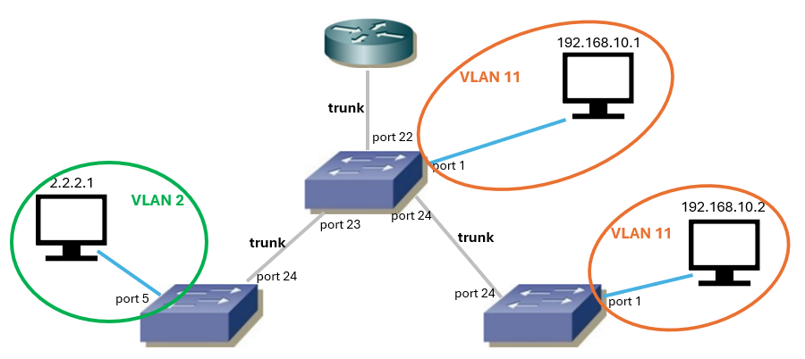

# Sieci - Lab 3 (VLAN)

Każdy z 3 switchów konfigurujemy do 3 vlanów:
- VLAN 11 - porty 1 - 4
- VLAN 2 - porty 5 - 8
- VLAN 18 - porty 9 - 12

Konfiguracja switcha:


```python
enable
    config t    # tryb konfiguracji globalnej
    vlan 11     # tworzy lub przechodzi do konfiguracji vlanu 11
    exit
...
    interface fa0/3
        switchport mode access       # tryb portu [access]
        switchport access vlan 11    # przypisanie do vlanu 11
        exit
...
    show interface status            # lista portów
```

Można też konfigurować parę portów naraz:
```python
    interface fa0/3 - 5    # konfiguracja portów od 3-5
```

Pomocnicze:
- `show interface status` - status portów na switchu
- `show vlan brief` - skrócone informacje o vlanach na urządzeniu
- `show vlan id 10` - szczegółowe informacje o vlanie 10
- `show interface fa0/24 trunk` - szczegółowe informacje o interfejsie fa0/24, jeśli jest skonfigurowany jako trunk.

## Ustawianie portu jako trunk

Na prostych switchach:
```python
interface fa0/24
    switchport mode trunk
```

Na tych bardziej zaawansowanych:
```python
interface fa0/24
    switchport trunk encapsulation dot1q  # <---
    switchport mode trunk
```

## Konfiguracja "routera na patyku"


```python
enable
    conf t
    int fa0/0.11
        encapsulation dot1q 11                    # enkapsulacja dot1q na vlan 11 dla tego interfejsu
        ip address 192.168.10.254 255.255.255.0   # przypisujemy ip i maskę do interfejsu (portu)
        exit
    int fa0/0.2
        encapsulation dot1q 2
        ip address 2.2.2.254 255.255.255.0
        exit
    int fa0/0
        no shutdown     # przełącza interfejs w stan up
```

Finalna topologia:

