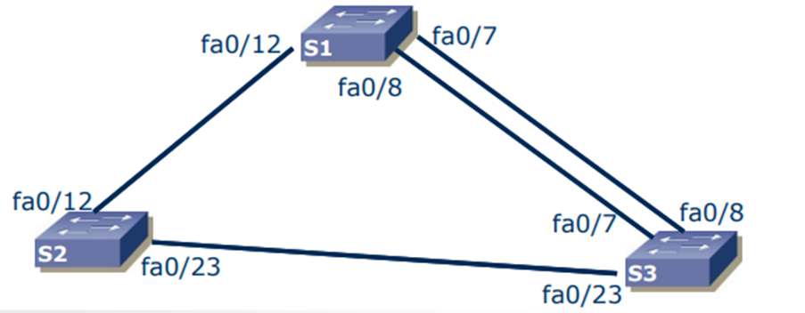
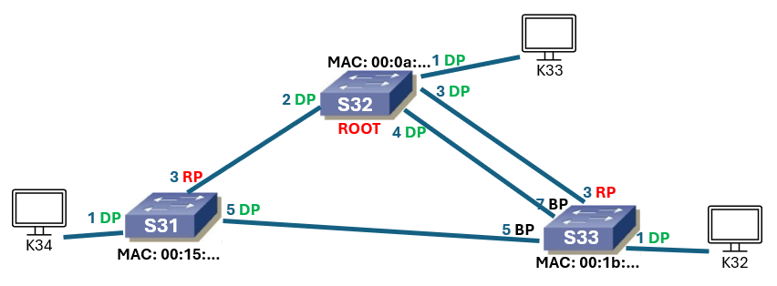

## Priorytety w STP

**Bridge ID** – `BID`  = {priorytet, MAC}    np. {32768:00:0a:51:1b}  
Im niższa liczba tym wyższy priorytet!

1. Wybór Root Bridge:  
    -> BID

2. Wybór Root port:  
    -> Path Cost, BID nadawcy BPDU, PortID (PID) nadawcy BPDU

3. Wybór Designated port:  
    -> Path Cost, BID, PID

4. Wybór Blocking port:  
    -> blokujemy te które nie są ani root, ani designated.


**Ogólny priorytet** (?): {PathCost, Sender BID, Sender PID, Receiver PID}


- **Kto jest nadawcą?**  
BPDU (Bridge Protocol Data Unit) jest zawsze tworzone i wysyłane przez Root Bridge.

- **Kto jest odbiorcą?**  
BPDU jest odbierane przez porty innych switchy w tym samym segmencie sieci.


## Stany switcha:

BLOCKING                                                  -> DISABLE (np. błąd na switchu)    
   V  
LISTENING (określa swoją pozycję w drzewie)               -> DISABLE  
   v  
LEARNING (uczy się, wypełnia swoją tablicę forwardingu)   -> DISABLE  
   v  
FORWARDING (przekazuje pakiety)                           -> DISABLE  


Może być switch asymetryczny: różne prędkości na różnych portach.


## Zadanie
Chcemy zobaczyć kto zostanie rootem, jakie porty będą miały funkcje, które połączenia będą aktywne.


Tak (chyba) powinno być:



Dodatkowe komendy do STP:
```c
Switch#show interface status 		// sprawdzamy, czy wykonane połączenia są aktywne
Switch#show spanning-tree vlan 1 	// tu też można przeczytać BID

Switch(config)# spanning-tree (vlan 1) priority xxxxx        // ustawianie priorytetu switcha na vlanie 1

Switch(config-if)# spanning-tree (vlan 1) port-priority xxx  // ustawianie priorytetu portu w switchu

Switch(config)# interface range fa0/5 - 8                  // konfiguracja wielu portów jednocześnie
Switch(config-if-range)# channel-group 1 mode desirable    // agregacja łączy?

Debug spanning-tree events   // logi wydarzeń związku z STP

no spanning-tree vlan 1      // wyłączenie stp na vlanie 1
```