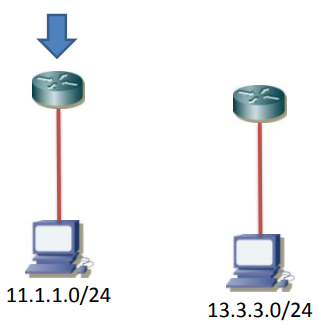
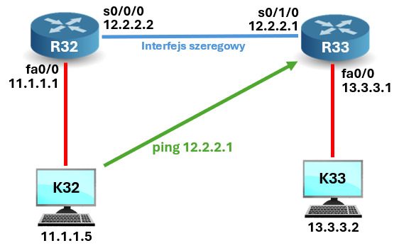
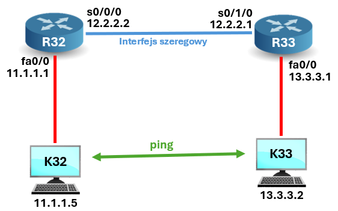

### DHCP



### Konfiguracja (sieci) interfejsu routera
```
enable
    config t
        int fa0/0
            ip address 11.1.1.1 255.255.255.0
            no shutdown
            end

show ip interface brief  <- podsumowanie interfejsów na routerze
show ip route            <- tablica routingu
```
---
### Konfiguracja serwera DHCP na routerze
```
enable
        config t
            service dhcp
                ip dhcp pool PULA_11
                    network 11.1.1.0 /24      <- pula adresów
                    default-router 11.1.1.1   <- brama
                    dns-server 11.1.1.2       
                    exit
                ip dhcp excluded-address 11.1.1.2 11.1.1.15
                end

show ip dhcp pool
show ip dhcp binding
show ip dhcp server statistics
```



**Ping** w tym przypadku **nie działa**.  
Sygnał dociera do drugiego routera, ale drugi router nie wie gdzie go odesłać, bo nie zna drogi powrotnej do naszego komputera.

### Routing statyczny

**Konfiguracja interfejsu szeregowego**
```
enable
    config t
        int s0/0
            ip address 12.2.2.1 255.255.255.252
            clock rate 125000    ! Tylko DCE !
            no shutdown
            end

show ip interface brief
show controllers serial 0/0
show ip route
```

---
**Jak skonfigurować trasę statyczną**
```
enable
    conf t
        ip route <dokąd> <którędy>
        ip route 13.3.3.0 255.255.255.0 12.2.2.2
        end

show ip route
```

W naszym przypadku:
```
na R32:  ip route 13.3.3.0 255.255.255.0 12.2.2.1
na R33:  ip route 11.1.1.0 255.255.255.0 12.2.2.2
```

Teraz można ping'ować ze sobą komputery:

