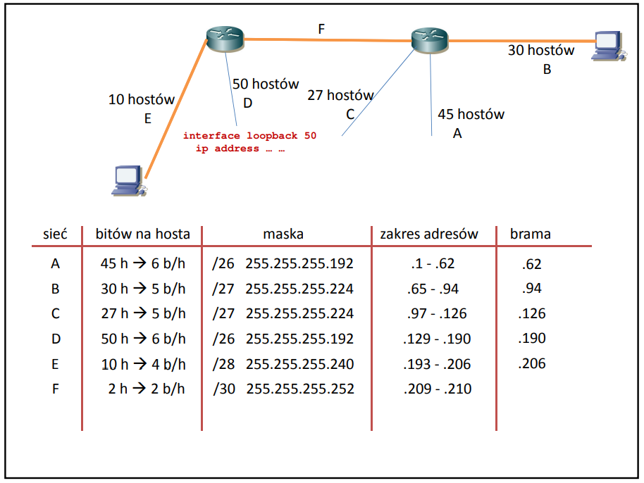
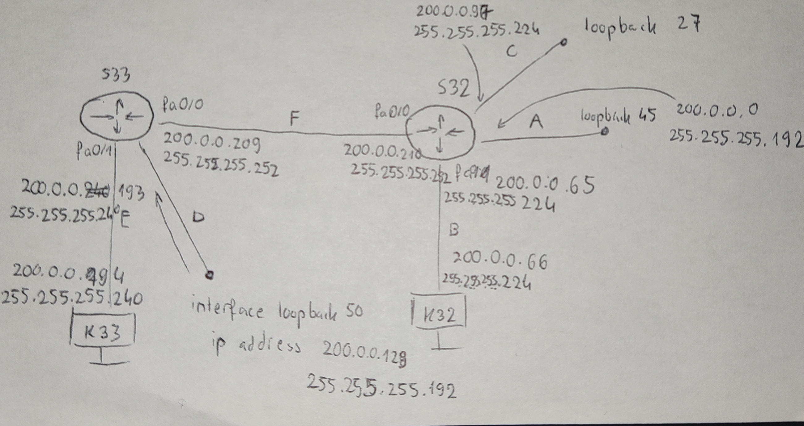
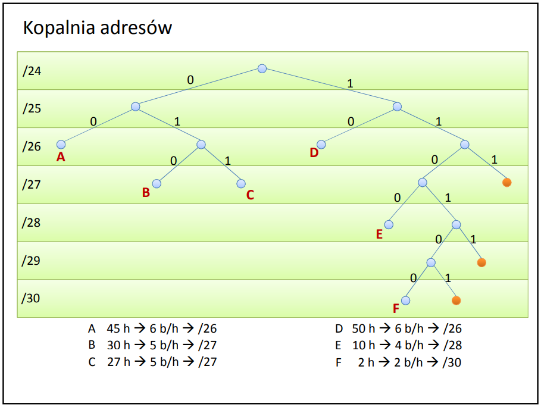

## Wprowadzenie na zajęcia

Mamy adres: 200.0.0.0 / 24

Mamy trzy grupy klientów:
- A: 45 hostów (+2)
- B: 30 hostów (+2)
- C: 27 hostów (+2)

! Do każdej grupy doliczamy adres na bramę i broadcast (+2) !

Tworzymy drzewo:

| Liczba hostów | Adresy | Maska |
| :------------ | :----: | ----: |
| 256 | 0-255 | 24 |
| 128 | 0-127, 128-255 | 25 |
| 64 | 0-63 (A), 64-127, ... | 26 |
| 32 | ..., 64-95 (B), 96-127 (C), ... | 27 |

Bramy:
- A: 200.0.0.0 / 26
- B: 200.0.0.64 / 27
- C: 200.0.0.96 / 27

Broadcasty:
- A: 200.0.0.63
- B: 200.0.0.95
- C: 200.0.0.127

Wolne adresy (dla klientów):
- A: 200.0.0.1 - 62
- B: 200.0.0.65 - 94
- C: 200.0.0.97 - 126


| Maska sieci zwykła | Skrócona |
| ------------------ | -------- |
| 255.255.255.0 | /24 |
| 255.255.255.128 | /25 |
| 255.255.255.192 | /26 |
| 255.255.255.224 | /27 |
| 255.255.255.240 | /28 |
| 255.255.255.248 | /29 |
| 255.255.255.252 | /30 |
| 255.255.255.254 | /31 |
| 255.255.255.255 | /32 |

Fajna strona: http://www.fatclicks.listy.info.pl/maska_sieci-tabelka.htm


## Zajęcia

Co mamy zrobić:



Co zrobiliśmy:



Drzewo adresów:




### Usuwanie routing statycznego

```
no ip route <dokąd ip i maska> <którędy>
```
